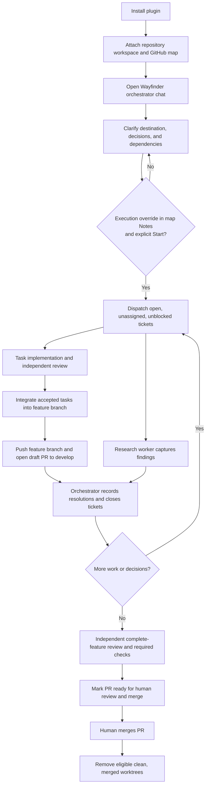
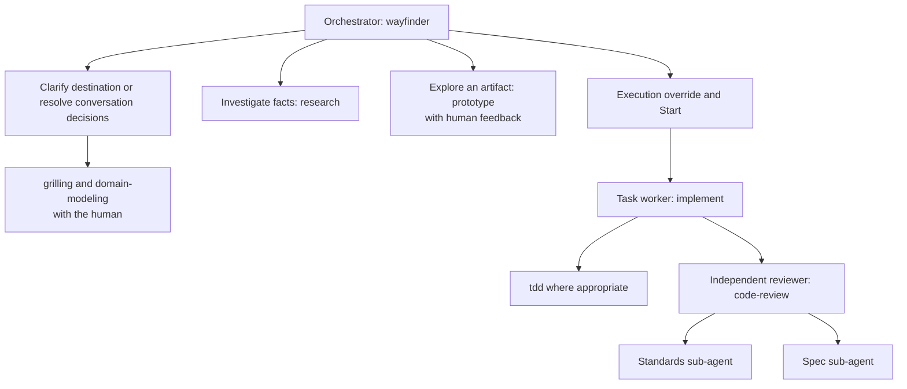
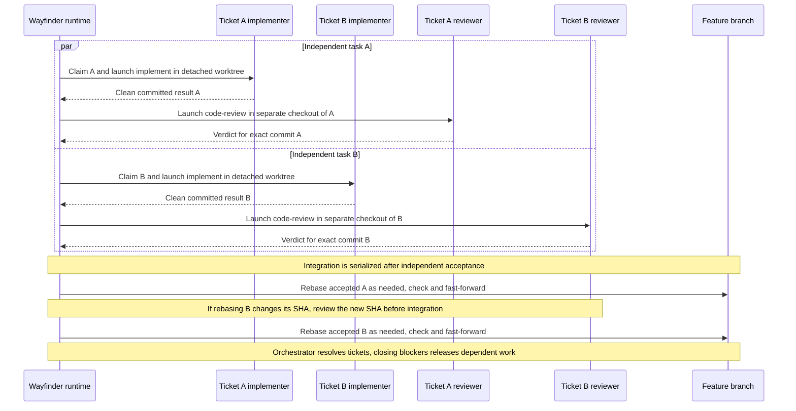
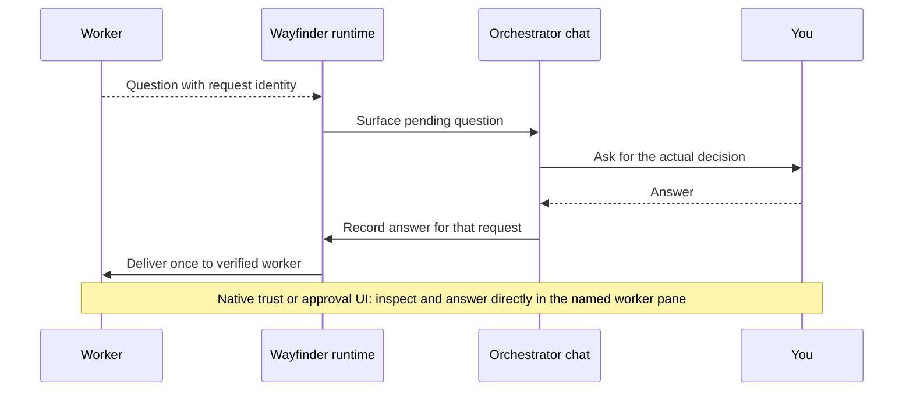

# Wayfinder for herdr

A Rust workflow plugin that coordinates a human-facing chat, map-scoped workers, independent reviews, Git integration, and a ready feature pull request.

- [Decision map](https://github.com/Quinten1505/wayfinder-herdr/issues/1)
- [Specification](https://github.com/Quinten1505/wayfinder-herdr/issues/10)
- [Tracker conventions](docs/agents/issue-tracker.md)

Use one orchestrator chat to plan an effort, answer questions, and follow progress. GitHub Issues holds the map, tickets, dependencies, and decisions. Once you authorize execution, the background runtime starts workers in Herdr, independently reviews their commits, and integrates accepted tasks into your feature branch. It opens a draft PR to `develop` during delivery and marks it ready after a complete-feature review and passing checks. You merge the PR.



Planning is the default. **Installing, attaching, or opening Chat does not authorize workers.** Dispatch requires both an execution override in the map's `## Notes` and an explicit Start. Research dispatch also uses this gate.

Jump to [startup](#start-using-wayfinder), [skills and agents](#skills-and-agents), [ticket pairs and integration](#when-ticket-pairs-start-and-how-work-is-integrated), [daily use](#daily-use-and-human-questions), or [recovery](#worker-controls-and-recovery).

## Start using Wayfinder

### 1. Install the plugin

Prerequisites: Linux, Rust/Cargo (see `rust-version` in [Cargo.toml](Cargo.toml)), a C linker, Python 3, GitHub CLI (`gh`) authenticated for the target repository, Herdr **0.9.3**, a running systemd user manager, and your configured agent CLI (Codex by default). Validated with Rust/Cargo 1.98.0; dependency metadata supports the declared Rust 1.85 minimum, which has not been exercised here. Cargo needs access to crates.io on the first build. Herdr's installed CLI and the bound server must both report 0.9.3; a newer release is not automatically assumed compatible.

The agents must have the skills described below available to them. The orchestrator bootstrap reads `~/.agents/skills/wayfinder/SKILL.md`; the installer does not install agent skills. Target repositories also need their tracker conventions and coding instructions available to workers.

**Current delivery support is for Rust/Cargo repositories.** The runtime runs fixed Cargo formatting, Clippy, and test checks; it does not yet offer a configurable check suite for other languages. The target repository needs an authenticated `origin` remote and a `develop` base branch.

From this source checkout:

```sh
./scripts/install.sh
```

This builds with `cargo build --release --locked`, copies the executable and manifest into `~/.local/lib/wayfinder-herdr`, links the plugin, installs `wayfinder-herdr@.service` in the user service directory, and reloads systemd. It does not attach, start, or enable a map runtime. `WAYFINDER_INSTALL_DIR` overrides the install directory. `XDG_CONFIG_HOME` and `XDG_STATE_HOME` are respected and recorded in the unit. The source checkout must remain available only for rebuilding, not for running the installed plugin.

Use the installer above to provision the plugin and supervision together. `sh scripts/build.sh` is a source build helper that creates a development binary in `bin/` without installing or linking it.

### 2. Open Herdr and prepare your target repository

From a normal terminal, launch Herdr or attach to your existing session:

```sh
herdr
# Or attach to an existing named session:
herdr session attach SESSION_NAME
```

Open the target repository as a Herdr workspace and use a shell pane in that workspace for the following commands. If you see **“nested herdr is disabled”**, launch or attach from a terminal outside Herdr; do not start another Herdr instance inside a worker or Codex pane. The Chat action will start the orchestrator agent for you.

For delivery, check out a clean `feature/<name>` branch before starting dispatch. To create a new effort from `develop`:

```sh
cd /absolute/path/to/target-repository
git fetch origin develop
git switch -c feature/my-effort origin/develop
```

If the effort already has a feature branch, check out that branch instead. Wayfinder integrates into the existing feature branch; it does not create it or create separate ticket branches.

### 3. Select a map and attach it

A map is a GitHub issue labelled `wayfinder:map`. Its tickets are native sub-issues, with native blocking dependencies. The repository needs the `wayfinder:*` labels listed below and GitHub permissions to create issues, assign/close tickets, push the feature branch, and manage its PR. Use an existing map, or create one with the installed binary:

```sh
WF="$HOME/.local/lib/wayfinder-herdr/bin/wayfinder-herdr"
"$WF" tracker create-map --repository OWNER/REPO \
  --title "Destination for this effort" --notes "Planning notes"
```

Set `MAP` to the identity of your map, then attach from the target repository's Herdr shell:

```sh
MAP='OWNER/REPO#NUMBER'
"$WF" attach --map "$MAP" --repository "$PWD" --workspace "$HERDR_WORKSPACE_ID"
"$WF" status --map "$MAP"
```

Attach binds this repository, Herdr session/socket, and owning workspace. It starts the map's systemd service in `awaiting_start`; a running service does not mean workers are authorized. The printed map key identifies `wayfinder-herdr@KEY.service` for logs.

### 4. Configure the agents

Set shared defaults before opening Chat or starting workers. Replace `MODEL` with a model supported by your installed provider:

```sh
"$WF" configure-worker --map "$MAP" \
  --kind codex --model MODEL --reasoning-effort high --concurrency 3
```

Omitting `--role` sets defaults for the orchestrator, researcher, implementer, and reviewer. To configure one role, add, for example, `--role reviewer`; the four role names are `orchestrator`, `researcher`, `implementer`, and `reviewer`. A role override is a complete provider configuration, so repeat the model, effort, and arguments you want for that role. Configure changes before the corresponding agent is launched; they do not change an already running chat or worker.

Provider-specific arguments are separate argv entries. For example, if your installed Codex supports these options:

```sh
"$WF" configure-worker --map "$MAP" --role implementer \
  --kind codex --model MODEL --reasoning-effort high \
  --arg=--approve-for-me --arg=-c --arg='service_tier="priority"'
```

Without explicit configuration the provider is Codex, model and effort use provider defaults, and worker concurrency is three. Concurrency counts active or reserved **workers**, not ticket pairs; the orchestrator chat is separate.

### 5. Open Chat, plan, then explicitly Start

In the target workspace, select the installed plugin action **Open or focus the Wayfinder orchestrator chat**. This starts one persistent orchestrator agent or focuses the existing verified chat. Use this action rather than running a bare `chat` command: it supplies Herdr's invoking-pane context.

Tell the chat your destination and ask it to chart or walk through the map. For example: “Walk through this map, show the unblocked tickets, and ask me about unresolved decisions.” Planning can create tickets, wire dependencies, and record decisions without authorizing background workers.

When you choose delivery, record this exact line under the map's `## Notes`:

```text
Execution override: selected by the user for this effort.
```

For a new map, `tracker create-map ... --execution-override` records this choice at creation. Existing map bodies remain human-owned; the runtime does not rewrite them to grant itself execution permission.

Then choose **Start Wayfinder dispatch**, or run:

```sh
"$WF" start --map "$MAP"
"$WF" status --map "$MAP"
```

Start queues a durable request. Status shows whether it has been applied and whether compatibility, enablement, or another condition is holding dispatch. Workers open in separate Herdr panes/worktrees in the owning workspace, even if you later focus another workspace. Herdr's normal repository trust checks still apply.

## Skills and agents

There is no unconditional chain through every skill. The `wayfinder` skill selects planning skills according to the question; the runtime selects worker skills according to ticket labels and completed results.



| Trigger | Herdr agent started by the plugin | Skill and purpose |
| --- | --- | --- |
| Open Chat | One persistent orchestrator | `wayfinder`: reads the map, coordinates decisions and resolutions, and routes actual human answers. Uses `grilling` and `domain-modeling` for destination/decision conversations and `prototype` for human feedback on exploratory artifacts. |
| Ready `wayfinder:research` ticket | Researcher | `research`: investigate and capture findings. This has no automatic implementation/reviewer pair. |
| Ready `wayfinder:prototype` ticket | Researcher in the current runtime | Currently receives `research`, too. The runtime does **not** directly launch a `prototype`-skill worker; arrange the human prototype discussion through the orchestrator. |
| Ready `wayfinder:task` ticket | Implementer | `implement`: read the issue/spec and repository instructions, implement in an isolated checkout, and return a clean committed result. May use `tdd` where appropriate and conduct its own review. |
| Valid completed implementation | New independent reviewer | `code-review`: review the exact implementation commit in a separate checkout, checking Standards and Spec. An implementer's own review does not replace this reviewer. |
| All task work integrated and other decisions resolved, with no pending work/questions | New complete-feature reviewer | `code-review`: review the entire `origin/develop..feature-HEAD` change against the map, canonical linked spec, and accepted decisions. |
| `wayfinder:grilling` or another human decision | No background worker | The orchestrator works with you; it cannot answer the human side of the conversation. |

The skill name sent to implementers is **`implement`**, not `implementation`. Worker prompts include the repository-qualified issue and map identities, linked spec when present, accepted decisions, and the result contract.

Skills can start their own helper sub-agents. In particular, `code-review` uses parallel Standards and Spec reviewers, and `research` can delegate investigation. Those helpers belong to the provider's skill execution; they are not extra Herdr worker pairs scheduled or counted by this plugin.

## When ticket pairs start and how work is integrated

The frontier contains open, unassigned map children whose blockers are all closed. Wayfinder claims a ticket through GitHub assignment before dispatch. Leave tickets unassigned if you want automatic dispatch; any existing assignment counts as a claim.

Independent frontier tickets can run in parallel within the shared concurrency limit. **Each task's pair forms sequentially: implementer first, reviewer after its valid committed result.** Queued reviews get priority when a worker slot becomes available.



This diagram shows the logical pairs; launches can wait for capacity. For example, concurrency two can run two implementers, then their reviewers as slots free up. A worker waiting for a human answer or an uncertain launch still reserves a slot.

For each accepted task, integration rebases the candidate onto the latest feature head when needed. A changed SHA requires a renewed independent review. The runtime then checks the exact candidate and fast-forwards the feature branch. Review findings, conflicts, or check failures can trigger bounded implementation repair and another review: up to three automatic review/rework rounds, with up to two automatic retries after confirmed worker failures. Exhaustion asks you to choose continue, defer, or abandon.

Current required delivery checks are:

```sh
cargo fmt --all -- --check
cargo clippy --locked --all-targets -- -D warnings
cargo test --locked --all-targets
```

Integration and ticket closure are separate. The orchestrator records the actual result, links artifacts, closes the ticket, and posts append-only map/spec update comments. It marks body refreshes as pending for a human. Research results also need an orchestrator resolution; they do not enter automatic task integration.

The runtime opens a draft PR to `develop` after the first integrated task. After the complete-feature reviewer accepts the exact final scope and checks pass, it marks the PR ready. Changes to the feature head, base, spec, or remaining work can invalidate readiness and return the PR to draft. **The human controls the final feature merge.**

Worktrees and evidence remain available through PR handoff. After observing the human merge, the runtime removes eligible clean implementation, review, and integration worktrees whose preserved commits are ancestors of the confirmed merge. Dirty, unmerged, uncertain, and research artifacts remain. It does not automatically close each finished agent pane at task integration; inspect or close those panes explicitly as needed.

## Daily use and human questions

Use the orchestrator chat as your main entry point: ask what is open, what is blocked, what needs your answer, and whether the feature is ready. Open worker panes for their logs or native provider dialogs.

| Plugin action | Effect |
| --- | --- |
| Open or focus the Wayfinder orchestrator chat | Return to the map's persistent chat. |
| Start Wayfinder dispatch | Explicitly authorize dispatch, subject to the map override and readiness checks. |
| Pause Wayfinder dispatch | Prevent new dispatch; retain active workers and their results. |
| Resume Wayfinder dispatch | Continue a previously started map. A first Resume cannot substitute for Start. |
| Wayfinder status | Inspect authorization, workers, questions, and retained resources. |
| Recover Wayfinder chat (confirm any interrupted launch is stopped) | Replace a missing/changed chat after checking the previous launch; see recovery below. |

Actions select the unique map attached to the invoking workspace and socket. If several maps match, use the CLI with an explicit `--map` for Start, Pause, Resume, or Status. Lifecycle commands return once their request is durably queued; inspect status for the applied outcome.



Answer ordinary worker questions in the orchestrator chat. Multiple questions can be collected into a round while independent work continues when capacity allows. For a native folder-trust or provider-approval dialog, open the named worker pane and respond there, then reconcile. An answer in chat cannot substitute for interacting with that UI.

## Worker controls and recovery

The examples below use `WF` and `MAP` from the startup steps. Replace request/run placeholders with the identities shown by status. Scheduler dispositions are choices: supply exactly one of `continue`, `defer`, or `abandon`.

Status displays run identities, worker questions and retained resources. The CLI exposes explicit controls for blocked/uncertain work:

```sh
"$WF" status --map "$MAP"
"$WF" answer-worker --map "$MAP" --run RUN_ID \
  --request-id HUMAN_REQUEST_ID --request-type worker_question \
  --response "the human's actual answer"
"$WF" stop-worker --map "$MAP" --run RUN_ID
"$WF" retry-worker --map "$MAP" --run RUN_ID --confirmed-absent-or-stopped
"$WF" abandon-worker --map "$MAP" --run RUN_ID
"$WF" chat-outbox --map "$MAP"
"$WF" resolve-chat-delivery --map "$MAP" \
  --message MESSAGE_ID --confirmed-not-delivered
"$WF" answer-decision --map "$MAP" \
  --request-id SCHEDULER_REQUEST_ID --response "the human's exact response" \
  --disposition continue
```

Workers return a run-correlated `.wayfinder-result.json`; the runtime archives it outside the checkout before clean-tree validation. Idle/done status alone is not success. Implementers must return a clean committed HEAD, and reviewers must name the exact pinned SHA without editing their checkout. Running workers reconnect only when pane, terminal, agent session, boot, and foreground process identities match. Uncertain launch/stop state retains capacity, claims, worktrees, and output instead of starting a duplicate worker.

`answer-worker` requires the exact pending request ID and type shown by `status`. For a recorded worker question (`worker_question`), it submits the provided human response through Herdr's occupant-pinned `agent.prompt` API, after verifying worker identity. If Herdr reports that the worker has entered a recognized approval or question UI (`herdr_blocked_ui`), `answer-worker` retains the supplied answer and request evidence but does not send input. Open the named Herdr pane, inspect and answer that UI directly, then run `reconcile`; the worker keeps its capacity and retained evidence until its later state can be observed. A worker question that races into a blocked UI gets a fresh manual-interaction request, and the earlier answer is retained without replay. Ambiguous answer or stop outcomes are not resent automatically. Retrying an uncertain worker requires the caller to explicitly confirm that the prior worker is absent or stopped. Abandoning records the human decision but does not prove termination, release uncertain capacity, or delete retained work.

If the orchestrator pane or agent identity is missing or changed, inspect the previous pane and invoke the installed Herdr **Recover Wayfinder chat** action (`recover-chat`) from the original repository workspace and same Herdr session. That action supplies Herdr's verified socket and invoking-pane context. Do not invoke the recovery binary as a bare CLI command from a Herdr pane: `--map` does not replace the required source workspace/pane context. Acknowledged launch stages reconnect without repeating an agent start or prompt. For an interrupted or uncertain stage, first inspect Herdr and confirm the old launch is absent or stop it manually, then invoke the action's confirmation; Recovery archives the prior binding and starts in a fresh pane. It never focuses, prompts, closes, or reuses the old pane, and leaves unknown panes untouched. Inspect ambiguous chat deliveries with `chat-outbox --map OWNER/REPOSITORY#NUMBER`. After checking the prior chat history, resolve each uncertain message explicitly with `resolve-chat-delivery --map OWNER/REPOSITORY#NUMBER --message MESSAGE_ID --confirmed-delivered` or `--confirmed-not-delivered`; only the latter permits a replay.

Scheduler exhaustion requests are separate from worker questions and never target a worker pane. The orchestrating human must provide both their exact freeform response and `--disposition continue|defer|abandon`; the response text never implies an action. `continue` queues one bounded implementation rework or conflict-repair round tied to the original run and fixed commit. A later exhausted round creates a new scheduler request. `defer` keeps ticket readiness held while releasing capacity for a proven-completed worker; the same request can later receive a new exact response and disposition. `abandon` releases only the proven-finished blocked run's capacity, preserves all attempts/evidence, and does not satisfy integration/readiness. The CLI persists the choice; runtime reconciliation applies it idempotently after restart. Unknown requests and attempts to change an already-applied action are rejected. Chat integrations should route the actual human response and explicit disposition to `answer-decision` without calling `agent.prompt`.

## GitHub map and ticket workflow

Attach a map before running ticket mutations so they share the map runtime's local state lock. New maps can be created while planning and start without an execution override:

```sh
"$WF" tracker create-map --repository OWNER/REPO \
  --title "Destination" --notes "Planning notes"
"$WF" tracker create-map --repository OWNER/REPO \
  --title "Destination" --notes "Selected scope" --execution-override
```

After attaching the map and setting `MAP`, create all tickets before wiring dependencies. Use the returned issue numbers in place of the examples below:

```sh
"$WF" tracker create-ticket --map "$MAP" --label wayfinder:research \
  --title "Research question" --body "The question and required evidence"
"$WF" tracker create-ticket --map "$MAP" --label wayfinder:task \
  --title "Implement selected behavior" --body "Requirements and acceptance criteria"
"$WF" tracker block --map "$MAP" --ticket 24 --by 23
"$WF" tracker frontier --map "$MAP"
```

Link a separate `wayfinder:spec` issue from the map when there is a specification, for example `Specification: [Feature specification](https://github.com/OWNER/REPO/issues/SPEC_NUMBER)`. Workers read accepted comments as well as issue bodies. The final review checks the canonical spec declaration, including newer named specification-pointer comments.

The orchestrator can record a resolution with the following command after the actual decision or accepted integration. Supply the target repository's spec number explicitly: the CLI default of `10` is specific to this project's original map.

```sh
"$WF" tracker resolve --map "$MAP" --ticket TICKET_NUMBER --spec SPEC_NUMBER \
  --resolution "Actual resolution and links to its evidence"
```

Planning operations, including ticket creation, dependencies, frontier reads, and decision resolution, do not require the execution override. Claims are GitHub assignments and require an affirmative execution override in the map Notes. Any existing assignment is a claim. A reassignment or closure racing with a claim makes its durable local intent uncertain; the command fails and preserves all GitHub assignments. To recover, `tracker reconcile-claim` reads the current issue, map membership, assignees, and blockers; it clears the uncertain hold only when GitHub proves the ticket is still open, unblocked, and assigned exclusively to the requested user. It never assigns or reassigns. Foreign, empty, closed, blocked, or unreadable states remain uncertain for later inspection. After confirming that no previous worker is active, the human can use `retry-worker --confirmed-absent-or-stopped`; this records a separate retry intent and the runtime reuses the proven assignment. On resolution, the orchestrator posts a named decision pointer comment on the map and a proposed specification delta comment on the spec. Both say **body refresh pending for a human**; automation never patches existing map/spec bodies. Stable operation markers let retries find comments after ambiguous writes without duplicating them. This follows the human decision in [How should map updates handle non-atomic GitHub body writes?](https://github.com/Quinten1505/wayfinder-herdr/issues/18#issuecomment-5931910902).

## State, restart, and upgrades

State lives in `${XDG_STATE_HOME:-~/.local/state}/wayfinder-herdr/maps/KEY`, outside the plugin checkout. A map key hashes normalized `owner/repository#number`, making the runtime exclusive per map within this machine's configured state root. Use one state root for all sessions; distinct overridden roots are separate installations and cannot arbitrate each other.

Each map has a lifetime kernel lock, a versioned `state.json`, and a durable request inbox. State updates use a synced temporary file, atomic rename, and directory sync. Applied request identities remain in history so crash replay cannot reapply them. The service restarts on failure; runtime authorization and queued requests survive process death. A 30-second default compatibility check (`attach --poll-seconds`) backs up hooks, with capped outage backoff. Missing/incompatible herdr or a disabled plugin suspends readiness.

Attach supports `--socket /absolute/socket` and `--herdr /absolute/herdr` to select the endpoint explicitly, and `--no-service` to initialize without starting systemd. Supply `--workspace WORKSPACE_ID` explicitly if `HERDR_WORKSPACE_ID` is unavailable. Existing state missing an owning workspace can be repaired by reattaching with `--workspace`; other binding changes remain rejected. For service logs, run `journalctl --user -u wayfinder-herdr@KEY.service` using the key printed by attach.

For manual upgrades:

1. Note active instances with `systemctl --user list-units 'wayfinder-herdr@*.service'` and stop those instances. The installer refuses replacement while an instance is active.
2. Back up the state root after stopping the services, update this source checkout, and rerun `./scripts/install.sh`.
3. Start the previously running instances with `systemctl --user start wayfinder-herdr@KEY.service`. Do not issue a fresh Start to override an existing pause.

Upgrades preserve the state root. Unsupported formats or fields produce actionable errors; the runtime never resets history or silently migrates it. Use a compatible plugin release or restore a compatible backup while the services are stopped. Preserve the rejected files for recovery. A changed repository or endpoint binding also requires explicit repair; reattachment does not silently rebind an existing map.

## Developing and checking the plugin

```sh
cargo fmt --all -- --check
cargo clippy --locked --all-targets -- -D warnings
cargo test --locked --all-targets
python3 tests/install_smoke.py
```

The installer smoke test builds and links in temporary XDG directories, substitutes a recording-only `systemctl`, and validates the generated unit with `systemd-analyze`; it does not start a live service.

Tests cover exclusive runtimes, durable requests and authorization across restart, replay, corrupt/future state preservation, host compatibility and disabled plugins. The isolated Herdr/Codex walkthrough and versioned evidence are in [docs/acceptance/issue-16-live.md](docs/acceptance/issue-16-live.md), for [Prove installation and the complete workflow in an isolated live session](https://github.com/Quinten1505/wayfinder-herdr/issues/16). The record separates real Herdr/runtime/Codex outcomes from automated fixtures, documents human decisions and recovery, and records the installer setup incident and known limitations.

Detached worktree and socket dispatch acceptance tests are included in `tests/dispatch.rs`; run them in an environment where isolated Unix sockets are permitted. The tracker issue body and spec remain human-owned and are never refreshed by worker automation; map/spec updates use append-only comments with body refresh pending for a human.
